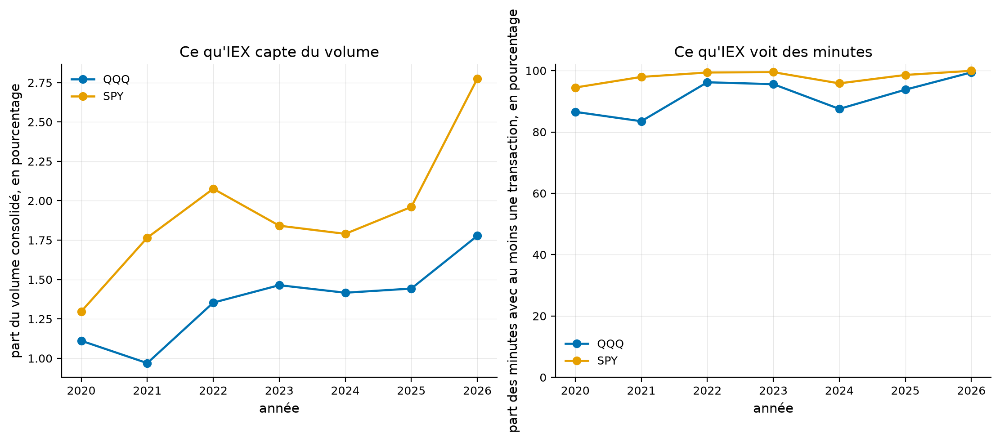
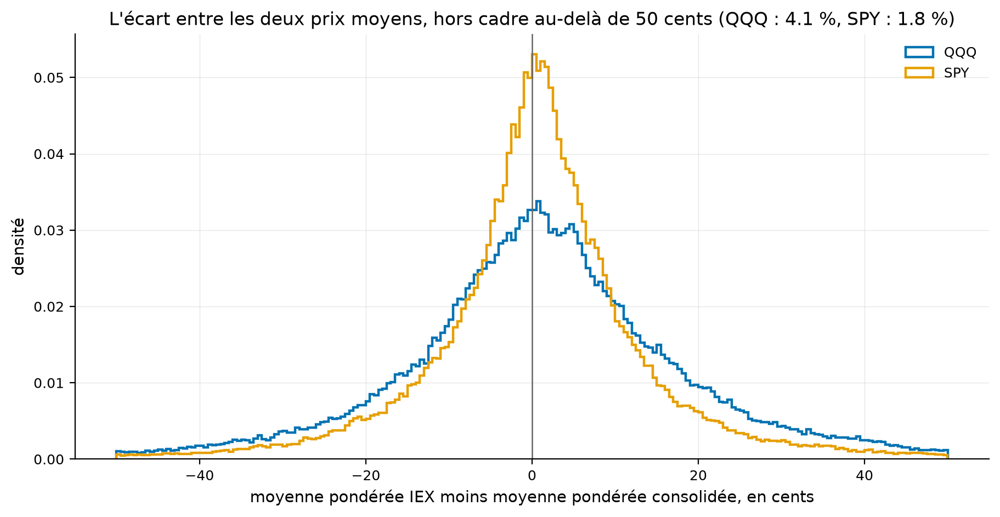
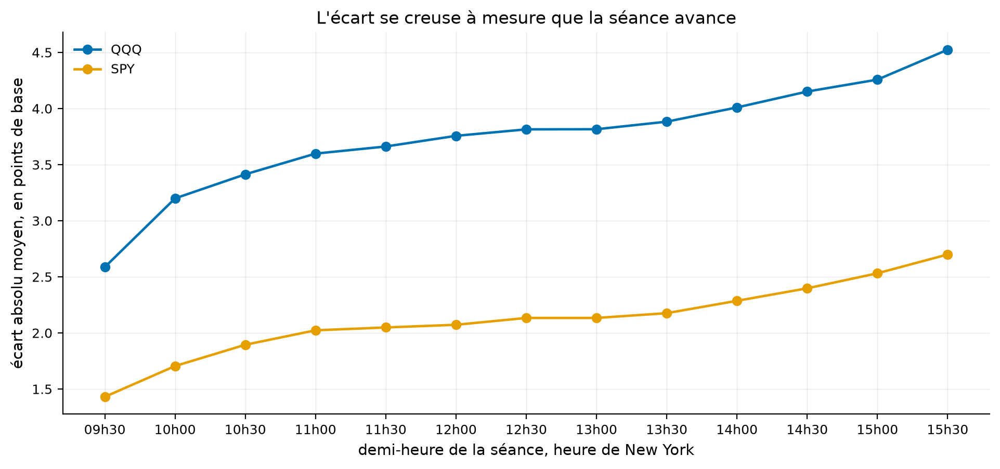
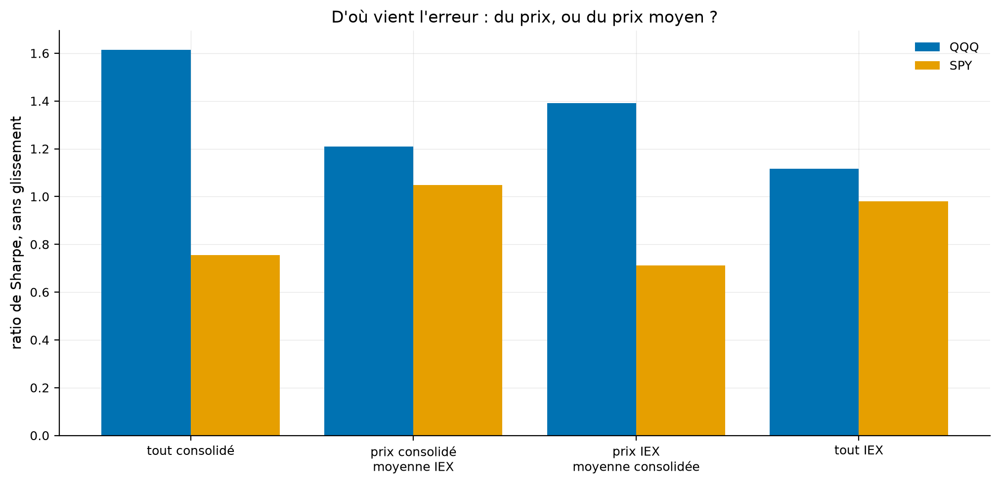
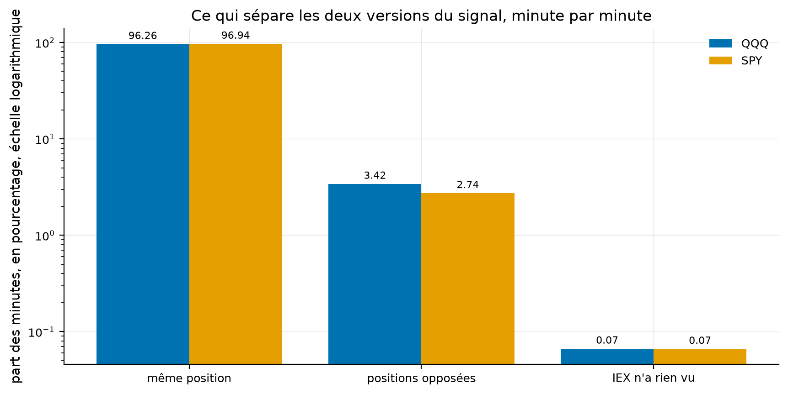

# Un flux gratuit suffit-il pour mesurer le prix moyen du marché ?

Une action américaine s'échange sur plusieurs bourses et systèmes privés. Le flux consolidé réunit ces transactions, tandis que le flux gratuit d'IEX n'en montre qu'une partie. Un prix instantané peut rester semblable d'un lieu à l'autre, mais une moyenne pondérée par les volumes dépend directement des transactions que le fournisseur a observées.

Le présent projet compare les deux flux minute par minute sur QQQ et SPY entre août 2020 et août 2026. Il rejoue ensuite la stratégie du projet 21 avec chaque mesure afin de voir si le choix de la source change la décision de négocier.

**Résultat principal.** IEX publie une barre dans 91,9 % des minutes de séance sur QQQ, mais il ne représente que 1,4 % du volume consolidé. Sa moyenne s'écarte de 9,6 cents en médiane et les deux flux recommandent des positions opposées pendant 3,4 % des minutes. Sur QQQ, le rendement total passe de 339 % à 189 % selon le flux. Sur SPY, il passe plutôt de 75 % à 105 %, ce qui montre un écart sans direction stable.

Afin de comprendre cet effet, nous présenterons d'abord l'organisation des marchés et la différence entre un prix et une moyenne. Dans un deuxième temps, nous décrirons les deux flux et leur couverture réelle pendant les heures de séance. Ensuite, nous comparerons les moyennes, les positions et les rendements. Enfin, nous utiliserons Polygon comme contrôle indépendant et nous présenterons les limites de l'expérience.

[](https://github.com/Guilou001/24-vwap-iex-vs-consolide/actions/workflows/ci.yml)


Le rapport détaillé est disponible en PDF : [rapport/rapport.pdf](rapport/rapport.pdf).

<details>
<summary>Résumé en anglais</summary>

*Summary in English. Every zero-budget replication computes VWAP on the IEX feed, the only US venue
publishing trades for free. Over 1 514 sessions on QQQ and 1 512 on SPY, from August 2020 to August
2026, IEX carries 1.4 % of consolidated volume on QQQ but prints a bar in 91.9 % of session minutes,
so sparsity is not the issue. Its running VWAP nevertheless sits a median 9.6 cents away from the
consolidated one, exceeds one cent on 93.8 % of minutes, and exceeds the price-to-VWAP distance the
signal actually measures on 5.3 % of minutes. Replaying the VWAP day-trading rule of repository 21
on each feed: 339 % versus 189 % total return on QQQ, but 75 % versus 105 % on SPY. The two feeds
hold opposite positions on 3.4 % of minutes. On QQQ a four-way decomposition attributes more of the
damage to the VWAP than to the price; on SPY the ordering does not hold. Polygon, an independent
aggregator, reprices the consolidated feed identically to a hundredth of a cent, which rules out the
provider as the source of the gap.*

</details>
## 1. La question en détail

**Les deux flux, en mots simples.** Une action américaine ne s'échange pas à un seul endroit. Une
transaction peut se faire sur seize bourses et sur une trentaine de systèmes privés, chiffres
rapportés et non revérifiés ici. Toutes remontent à un agrégateur officiel, le **flux consolidé**,
qui est ce que voient les pupitres. IEX est une de ces bourses, et c'est celle que les fournisseurs
de données offrent sans abonnement.

**Pourquoi cela devrait être sans conséquence.** Le prix instantané est le même partout, à
l'arbitrage près. Une action ne peut pas valoir 400,10 dollars sur une bourse et 400,50 sur la
voisine.

**Pourquoi ce ne l'est pas.** Le prix moyen pondéré par les volumes n'est pas un prix, c'est une
**moyenne sur les transactions vues**. Le consolidé les voit toutes, IEX porte un
soixante-treizième du volume échangé, et rien ne garantit que la moyenne d'un soixante-treizième du
volume ressemble à la moyenne du tout.

**La question du dépôt.** De combien les deux moyennes s'écartent-elles, et cet écart suffit-il à
faire changer d'avis un signal qui compare le prix à la moyenne ?

## 2. D'où vient le projet, et ce qu'il apporte

Quatre apports.

- **Deux mesures de couverture qui ne disent pas la même chose** : la part du volume, qui donne le
  poids de la bourse, et la part des minutes, qui donne la densité de l'information reçue.
- **La distribution complète de l'écart** entre les deux moyennes, sur 1,18 million de minutes et
  deux symboles, avec le point de comparaison qui la rend interprétable.
- **Le signal du dépôt 21 rejoué en quatre versions**, qui séparent l'erreur venue du prix de celle
  venue de la moyenne.
- **Un contrôle par un troisième fournisseur**, sans quoi la comparaison entre deux séries du même
  fournisseur ne prouverait rien.

**Deux corrections à des mesures antérieures de ce portefeuille**, qui vont dans le même sens. La
première annonçait qu'IEX ne voit rien sur 57 % des minutes. C'est vrai de la **journée entière**,
extensions d'avant et d'après-bourse comprises, et faux de la séance, où la présence atteint 99,7 %
en juin 2026. La seconde annonçait 3,45 % d'écart de volume entre deux agrégateurs du consolidé.
C'est encore la journée entière, et la séance seule donne **0,66 %**. La règle qui s'en dégage vaut
au-delà de ce dépôt : une statistique calculée sur les 1 440 minutes du jour décrit surtout les
heures creuses, alors qu'une stratégie de séance ne vit que dans 390 d'entre elles.

Les deux chiffres corrigés, 57 % et 3,45 %, sont des mesures de sessions antérieures. Ils sont
rappelés ici pour être corrigés, et ce dépôt ne les recalcule pas. Les deux chiffres qui les
corrigent, eux, sortent de `results/tables/`.

## 3. Les données

Barres d'une minute d'Alpaca, prix bruts, sur QQQ et SPY, du **3 août 2020 au 28 août 2026**, sur les
deux flux. Séances régulières de 9 h 30 à 16 h, séances incomplètes retirées : **1 514 séances** sur
QQQ et 1 512 sur SPY, soit 590 460 et 589 680 minutes.

Le filtre garde les séances où le flux consolidé publie bien ses 390 barres. Sur QQQ il en retire 12,
qui sont toutes des veilles de congé écourtées. Sur SPY il en retire 14, dont deux séances ordinaires
où le consolidé lui-même a manqué quelques minutes, le 2021-05-05 avec 385 barres et le 2023-06-05
avec 386. C'est toute la différence entre 1 514 et 1 512.

La fenêtre commence au 3 août 2020 parce que c'est là que commence la profondeur d'Alpaca sur le flux
IEX, mesurée le 30 août 2026. Cette profondeur est glissante, donc elle avance : une réexécution plus
tard ne retrouvera pas les premiers mois.

Contrôle indépendant : Polygon, sur juin 2026, la limite de son offre gratuite étant de deux ans
glissants.

## 4. Les résultats

### 4.1 Le problème n'est pas qu'IEX se taise

| | QQQ | SPY |
|---|---:|---:|
| Part du volume consolidé | **1,37 %** | 1,95 % |
| Part des minutes avec au moins une transaction | **91,9 %** | 98,2 % |
| Minutes muettes | 48 053 | 10 743 |
| Séances sans aucune barre d'IEX | **1** | 1 |
| Retard médian à la première transaction, sur les autres séances | 0 minute | 0 minute |
| Retard le plus long, sur les autres séances | 1 minute | 0 minute |

Comment lire ce tableau, en trois constats. Le premier est que les deux mesures racontent des
histoires opposées. IEX porte moins de 2 % du volume et publie pourtant une barre dans plus de neuf
minutes sur dix, donc il est presque toujours là mais ne voit presque rien. Le deuxième est que le
retard à l'ouverture n'atteint jamais deux minutes sur les séances où IEX finit par voir quelque
chose, 1 513 sur QQQ et 1 511 sur SPY. Mais le 2025-03-10 il ne publie aucune barre, sur les deux
symboles, et un programme branché sur ce seul flux reste alors hors du marché les 390 minutes de la
séance, pendant que QQQ baisse de 2,10 %. Le troisième est que la présence est plus haute en fin de
fenêtre qu'au début, de 83,5 % en 2021 à 99,4 % sur les huit premiers mois de 2026 sur QQQ. Ce n'est
pas une amélioration régulière, 2024 retombant à 87,5 %, et le trou qui se referme ne règle rien :
le reste de ce dépôt mesure le problème sur toute la fenêtre.



Comment lire cette figure : deux volets, parce que les deux grandeurs n'ont ni la même échelle ni le
même sens et que les superposer suggérerait une relation que rien n'établit. Le volet de droite
retombe en 2021, en 2023 et en 2024 sur QQQ, ce qui se voit mal dans une moyenne d'ensemble. Les
années 2020 et 2026 sont partielles, 104 et 165 séances contre 247 à 251 pour les autres.

### 4.2 L'écart entre les deux moyennes, et ce à quoi il faut le comparer

| | QQQ | SPY |
|---|---:|---:|
| Écart médian, en valeur absolue | **9,61 cents** | 6,25 cents |
| Biais moyen, signé | +1,91 cent | +0,90 cent |
| Écart type | 22,93 cents | 16,49 cents |
| Part des minutes au-delà d'un cent | **93,8 %** | 90,0 % |
| Part des minutes au-delà de cinq cents | 71,1 % | 57,5 % |

Comment lire ce tableau, en trois constats. Le premier est que l'écart dépasse le cent, c'est-à-dire
le pas de cotation, sur plus de neuf minutes sur dix. Les deux moyennes ne sont donc pas la même
grandeur mesurée deux fois, ce sont deux grandeurs différentes. Le deuxième est que le biais est
positif dans les deux cas, donc la moyenne d'IEX se tient au-dessus de celle du marché, ce que ce
dépôt mesure sans l'expliquer. Le troisième est que ces cents ne veulent rien dire tant qu'on ne les
compare à rien, et c'est l'objet du tableau suivant.

Le point de comparaison est la **distance entre le prix et sa moyenne pondérée**, puisque c'est le
signe de cette distance que la règle regarde. Elle se lit en points de base, le centième d'un pour
cent, unité qui rend comparables deux titres dont les prix n'ont pas le même niveau.

| | QQQ | SPY |
|---|---:|---:|
| Distance médiane entre le prix et sa moyenne | 23,3 points de base | 15,6 points de base |
| Écart médian entre les deux moyennes | 2,35 points de base | 1,27 point de base |
| Rapport des deux | **10,1 %** | 8,2 % |
| Part des minutes où l'écart dépasse la distance | 5,3 % | 4,5 % |
| Part des minutes où la moyenne d'IEX renverse le signe | **2,73 %** | 2,27 % |

Comment lire ce tableau, en trois constats. Le premier est que l'écart vaut un dixième de ce que le
signal mesure : dans le cas ordinaire, il ne fait pas basculer la décision. Le deuxième est que les
deux dernières lignes ne comptent pas la même chose. Dépasser la distance est une condition
nécessaire pour que le signe change, jamais suffisante. L'écart doit encore pousser du même côté que
la distance, ce qui arrive un peu plus d'une fois sur deux. Le troisième est que ce renversement
touche 2,73 % des minutes sur QQQ, soit 10,6 minutes par séance sur 390, ce qui n'est pas une petite
quantité pour une stratégie qui décide à chaque minute. La dernière ligne ne remplace que la
moyenne et compare à la minute même. La section 4.4 remplacera aussi le prix et décalera d'une
minute, et son chiffre sera plus grand. Ce tableau donne des fréquences et non l'attribution du
rendement, qu'il n'établit pas.



Comment lire cette figure : l'axe est coupé à cinquante cents de part et d'autre, la queue au-delà
étant trop fine pour se voir. La part des minutes hors cadre est écrite dans le titre.

| Quantile de l'écart absolu | QQQ, en cents | QQQ, en points de base | SPY, en cents |
|---|---:|---:|---:|
| médiane | 9,61 | 2,35 | 6,25 |
| trois quarts | 19,05 | 4,76 | 12,86 |
| neuf dixièmes | 33,44 | 8,58 | 23,14 |
| dix-neuf vingtièmes | 45,77 | 11,88 | 33,18 |
| quatre-vingt-dix-neuf centièmes | 79,32 | 21,15 | 59,06 |
| **maximum** | **603,95** | **145,68** | 395,47 |

Comment lire ce tableau, en trois constats. Le premier est que la queue est longue : le centième le
plus défavorable dépasse 79 cents sur QQQ, et le pire atteint 6 dollars. Le deuxième est que ce pire
cas vaut 145 points de base, donc six fois la distance médiane entre le prix et sa moyenne. Ces
minutes-là, le signal calculé sur IEX ne mesure plus rien. Le troisième est que SPY est partout plus
bas que QQQ, à chaque quantile et dans les deux unités. Le rapport des écarts médians vaut 1,54 en
cents et 1,84 en points de base, quand SPY porte 1,42 fois la part de volume de QQQ. La direction
est celle qu'on attend si l'écart vient de la taille de l'échantillon, et deux symboles ne suffisent
pas à l'établir.



Comment lire cette figure : l'écart croît de façon monotone du matin au soir, de 2,59 à 4,52 points
de base sur QQQ. C'est ce qu'on attend d'une moyenne cumulée, dont les deux versions divergent en
s'accumulant, et c'est le pire moment possible : la dernière demi-heure est celle où un signal de
suivi de tendance décide de solder.

### 4.3 Le même signal, joué sur chacun des deux flux

Le signal est celui du dépôt 21 : acheter quand le prix est au-dessus de sa moyenne pondérée depuis
l'ouverture, vendre à découvert sinon, solder à la clôture. Le rendement encaissé est toujours celui
du vrai marché, quel que soit le flux qui décide. La dernière colonne compte les changements de
position par jour, un renversement complet d'acheteur à vendeur comptant pour un et un simple retour
à plat pour un demi.

| Symbole | Version | Rendement total | Par an | Sharpe | Pire creux | Changements par jour |
|---|---|---:|---:|---:|---:|---:|
| QQQ | tout consolidé | **+339,5 %** | 27,9 % | **1,61** | 17,2 % | 16,20 |
| QQQ | tout IEX | **+189,2 %** | 19,3 % | **1,12** | 22,9 % | 16,71 |
| SPY | tout consolidé | **+75,1 %** | 9,8 % | **0,75** | 19,5 % | 17,20 |
| SPY | tout IEX | **+105,0 %** | 12,7 % | **0,98** | 13,8 % | 17,55 |

Comment lire ce tableau, en trois constats. Le premier est que le flux gratuit coûte 150 points de
rendement sur QQQ et en **rapporte 30 sur SPY**. L'erreur n'a donc pas de signe et ne se corrige
pas ; un chercheur qui aurait choisi SPY conclurait que le flux gratuit convient très bien. Le
deuxième est que le flux gratuit fait tourner davantage, 16,71 changements de position par jour
contre 16,20, donc il coûte aussi plus cher à exécuter, et cet effet-là, lui, va toujours dans le
même sens. Le troisième est qu'à un cent de glissement le classement se durcit : la version
consolidée de QQQ garde +25,9 % quand la version IEX tombe à **−20,8 %**. Deux symboles ne disent
rien de l'ampleur qu'aurait l'écart sur un troisième.



Comment lire cette figure : les deux barres du milieu croisent les flux, prix de l'un et moyenne de
l'autre. Sur QQQ elles se rangent entre les deux versions pures, et celle qui garde la moyenne
consolidée est la meilleure des deux, donc la moyenne porte plus d'erreur que le prix. Sur SPY
l'ordre n'est même pas respecté, la version au prix consolidé et à la moyenne IEX dépassant les deux
versions pures : c'est la signature d'un bruit et non celle d'un défaut systématique.

### 4.4 Une minute sur vingt-neuf, les deux flux tiennent des positions opposées

| | QQQ | SPY |
|---|---:|---:|
| Même position | 96,26 % | 96,94 % |
| **Positions opposées** | **3,42 %** | **2,74 %** |
| IEX ne décide rien, faute d'avoir vu ou par égalité exacte | 0,067 % | 0,066 % |
| Aucun des deux ne décide, première minute de séance | 0,256 % | 0,256 % |

Comment lire ce tableau, en trois constats. Le premier est que le silence est cinquante fois plus
rare que le contresens : le trou de couverture, qui est le défaut visible du flux gratuit, n'est pas
celui qui coûte. Le deuxième est que les positions opposées touchent une minute sur vingt-neuf sur
QQQ, et qu'une position opposée ne coûte pas le mouvement du marché mais deux fois ce mouvement. Le
troisième est que ces 3,42 % sont assez nombreux pour porter l'écart de rendement de la section
précédente, alors que le silence, à 0,067 %, ne l'est pas. Ces 3,42 % ne sont pas les 2,73 % de la
section 4.2 : ici le prix et la moyenne viennent tous deux d'IEX, et la position est celle qu'a
décidée la minute précédente. Ce tableau donne des fréquences. Le coût sommé de chacun des deux cas
est dans `results/tables/desaccords.csv`, non composé, donc il ne se retranche pas des rendements de
la section précédente.

Le silence n'est d'ailleurs pas ce qu'il paraît. Il vaut 394 minutes sur QQQ et 391 sur SPY, dont
**389 sur la seule séance du 2025-03-10**, celle où IEX ne publie aucune barre. Hors ce jour-là, il
en reste 5 sur QQQ et 2 sur SPY en six ans. Le mode de défaillance mesuré est donc la panne d'une
séance entière, et non le retard de quelques minutes à l'ouverture qu'un lecteur imaginerait.



Comment lire cette figure : les trois barres sont les trois premières lignes du tableau, la
quatrième, celle où personne ne décide, n'y figurant pas. L'échelle est logarithmique, sans quoi les
deux petites barres seraient invisibles à côté de l'accord à 96 %.

### 4.5 Le contrôle : ce n'est pas le fournisseur

Tout ce qui précède compare deux séries livrées par le même fournisseur. Si ce fournisseur se
trompait sur l'une des deux, rien dans la comparaison ne le montrerait.

Les deux séries sont coupées sur la même fenêtre horaire avant d'être confrontées. Polygon publie
aussi les extensions d'avant et d'après-bourse, qu'Alpaca a déjà perdues au chargement. Sans cette
coupe, les 11 685 barres hors séance de juin 2026 se compteraient comme des minutes manquées par
Alpaca, ce qui décrirait un trou de couverture qui n'existe pas.

| Contrôle sur QQQ, juin 2026 | Mesure |
|---|---:|
| Minutes de séance communes aux deux agrégateurs | 8 190 |
| Minutes publiées par l'un et absentes de l'autre | **0** |
| Prix identiques au dixième de cent | **100 %** |
| Écart de prix maximal | 0,01 cent |
| Écart de volume agrégé sur le mois | 0,66 % |
| Écart de volume de la minute médiane | 0,21 % |
| Écart de volume du neuvième décile | 2,21 % |

Comment lire ce tableau, en trois constats. Le premier est que deux chaînes de collecte
indépendantes publient les mêmes prix au dixième de cent sur la totalité des 8 190 minutes du mois,
leur écart le plus grand valant un centième de cent. Le flux consolidé de ce dépôt est donc bien le
flux consolidé. Le deuxième est que l'écart de volume subsiste et qu'il n'est pas régulier : 0,21 %
à la minute médiane, 2,21 % au neuvième décile, 0,66 % rapporté au volume du mois entier. Une étude
de volume, contrairement à une étude de prix, ne peut donc pas prendre l'un ou l'autre
indifféremment. Le troisième est ce que ce contrôle ne prouve pas : il n'exclut pas que les deux
agrégateurs se trompent de la même façon, et le dépôt ne le prétend pas.

## 5. La méthode, pas à pas

1. **Poser les deux flux sur la même grille de minutes**, celle du consolidé, parce qu'elle est
   complète. Les minutes où IEX n'a rien vu restent vides.
2. **Ne rien inventer à leur place.** Une minute sans transaction chez IEX n'ajoute rien aux deux
   cumuls, donc laisse sa moyenne pondérée inchangée. Le prix, lui, est reporté depuis la dernière
   minute vue : c'est le dernier prix qu'un programme branché sur ce seul flux connaîtrait.
3. **Cumuler séparément** le montant échangé et le volume, de l'ouverture à chaque minute, sur chacun
   des deux flux.
4. **Rejouer le signal en quatre versions**, le prix et la moyenne venant chacun de l'un ou l'autre
   flux, la position d'une minute étant toujours décidée par la minute précédente.
5. **Confronter le consolidé à un troisième fournisseur** sur la fenêtre que son offre gratuite
   permet.

## 6. Reproduire

```bash
uv sync --locked --all-extras
uv run pytest                        # 34 tests fermés, sans réseau ni données de marché
uv run vic fetch --controle          # les deux flux sur six ans, plus le mois de contrôle
uv run vic tout                      # les cinq études et les cinq figures
```

Le téléchargement demande une clé Alpaca, et le contrôle une clé Polygon, à poser dans
l'environnement ou dans un fichier local que le client partagé lit. Aucune clé n'est dans le dépôt.
Les tests tournent sur deux séances de quatre minutes dont chaque réponse se calcule de tête. Les
chiffres des tableaux et des figures sortent tous des fichiers de `results/tables/`. Trois nombres du
texte se mesurent ailleurs, dans les barres en cache : la date de la séance muette, la baisse de
2,10 % de QQQ ce jour-là, et les 11 685 barres hors séance de Polygon. Les deux chiffres de la
section 2 qu'il corrige, 57 % et 3,45 %, viennent de mesures antérieures et n'y figurent pas.

## 7. Limites, avec leur statut

| Limite | Statut |
|---|---|
| La fenêtre commence en août 2020, faute de profondeur sur le flux IEX | mesuré ; la profondeur est glissante, donc une réexécution ultérieure aura une fenêtre plus courte |
| Deux symboles seulement, tous deux très liquides | déclaré ; sur un titre peu traité, la part des minutes muettes serait bien plus haute, donc les écarts mesurés ici sont un plancher |
| Une séance entière sans aucune barre d'IEX, le 2025-03-10 | mesuré ; une seule sur 1 514, mais elle porte 389 des 394 minutes de silence et un programme branché sur IEX y reste hors du marché toute la journée |
| Le filtre des séances complètes écarte aussi deux séances ordinaires sur SPY | mesuré ; le 2021-05-05 et le 2023-06-05, où le consolidé lui-même publie 385 et 386 barres |
| Le biais positif de la moyenne IEX n'est pas expliqué | déclaré ; il est mesuré à +1,91 cent sur QQQ et +0,90 sur SPY, et sa cause n'est pas établie |
| Le contrôle Polygon ne porte que sur un mois | déclaré ; c'est la limite de l'offre gratuite, et un mois suffit à trancher entre accord et désaccord, pas à mesurer une dérive lente |
| Le contrôle n'exclut pas une erreur commune aux deux agrégateurs | reconnu ; il établit l'accord, pas la vérité |
| Le report du dernier prix connu est un choix | déclaré ; c'est ce que fait un programme branché sur le seul flux IEX, et une autre convention donnerait d'autres nombres |
| Les rendements sont calculés de clôture de minute à clôture de minute | déclaré ; le glissement facturé approche le coût réel d'exécution sans le modéliser |
| L'écart de rendement entre les deux flux n'est pas encadré par une incertitude | déclaré ; deux symboles ne permettent pas d'en estimer une, et c'est précisément pourquoi le résultat est présenté comme du bruit et non comme un biais |

## 8. Crédits, licence, citation

Données de marché : Alpaca, flux consolidé et flux IEX, compte gratuit, usage personnel ; Polygon,
offre gratuite, pour le seul contrôle. Aucune barre n'est redistribuée. Code sous licence MIT,
rapport sous licence CC BY 4.0. Figures et client de données produits par
[gv-fintools](https://github.com/Guilou001/gv-fintools).

Voisinage dans le portefeuille :
[21-vwap-intrajournalier](https://github.com/Guilou001/21-vwap-intrajournalier) porte le signal
rejoué ici et mesure ce que le glissement lui coûte. Celui-ci ne touche pas au signal et mesure ce
que la source de données lui fait dire.
[22-derniere-demi-heure](https://github.com/Guilou001/22-derniere-demi-heure) travaille sur le même
flux consolidé, chez le même fournisseur. Le rapport `rapport/rapport.pdf` est engendré depuis ce
README.
